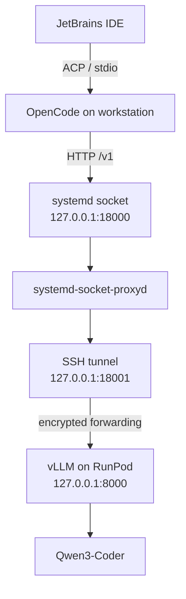
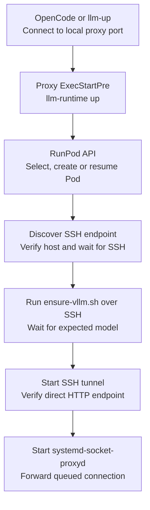
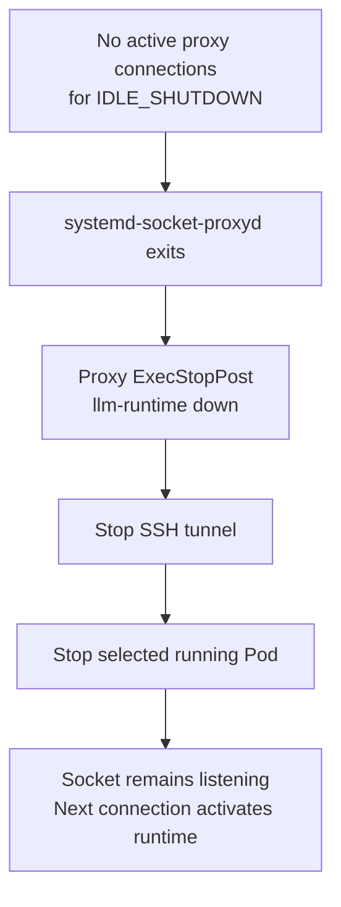

# Architecture

## Request path

Ports shown are the defaults. Both host listeners and vLLM bind to loopback.

OpenCode owns local file, shell, build, and test operations. The Python
controller manages one non-interruptible GPU Pod through the RunPod REST API,
then connects as `root` over its public TCP SSH endpoint. Only `22/tcp` is
requested in the Pod definition. Model requests travel through SSH; lifecycle
requests use the RunPod HTTPS API.

## Activation and shutdown

### Activation

### Idle shutdown

### Lifecycle details

`opencode-runpod` generates configuration and starts `llm-up` in the background
while OpenCode starts. `llm-up` ensures generated units match configuration,
opens `/v1/models` on the socket, and monitors activation. It also recovers an
active proxy whose tunnel no longer responds.

Pod selection uses `runtime.pod-id` first. Only a missing selection or a
provider 404 permits exact-name adoption; multiple matches fail. A new Pod is
created only by startup when no match exists. Shutdown uses the same selection
logic and can adopt a named Pod; status never adopts or replaces a selection.
A live persisted ID takes precedence over changes to `RUNPOD_POD_NAME`.

The SSH endpoint is bound to the selected Pod ID in local state. Stable
endpoints retain their host key. A provider-confirmed endpoint change for the
same Pod removes only the obsolete address from `known_hosts`. A changed Pod
identity or host-key mismatch fails closed. See [SSH trust](../SECURITY.md#dynamic-ssh-endpoints-and-host-keys).

Runtime startup, shutdown, full installation, and integration removal share a
nonblocking `flock` with bounded retries. Installation waits up to 30 seconds;
other operations use `LIFECYCLE_LOCK_TIMEOUT_SECONDS`. This does not serialize
all CLI actions: `llm-up` unit reconciliation and `llm-down` socket/proxy stops
occur outside that lock. Never delete `runtime.lock` to resolve contention.

The proxy startup budget is `RUNPOD_START_TIMEOUT_SECONDS` plus
`VLLM_START_TIMEOUT_SECONDS` plus 120 seconds. Pod endpoint discovery and SSH
readiness share the first budget; tunnel readiness gets 60 seconds. The proxy
stop timeout is three minutes. The tunnel restarts on failure after five
seconds. These budgets are not individual subprocess deadlines.

Idle means no active proxy connections, not absence of generated tokens.
`llm-down` stops the listener and proxy before runtime shutdown; it does not
remove socket enablement. Shutdown clears transient runtime metadata and
attempts both tunnel and Pod cleanup, reporting accumulated errors.
`ExecStopPost` also runs after failed activation; diagnostics may be cleared
by cleanup, so the service journal is the fallback.

`llm-down --remove-integration` asks for confirmation before any shutdown and
then removes `opencode.json` and the configured ACP agent entry. It preserves
units, configuration, credentials, Pod identity, storage, and other agents.
Future installation or activation can recreate the integration.

## Remote runtime and storage

The image contains Python 3.11 and the vLLM environment at
`/opt/llm-coding/vllm`. It retains the RunPod base image's SSH startup command.
The controller sends the packaged `remote/ensure-vllm.sh` over SSH; this script
runs `/opt/llm-coding/bin/start-vllm.sh`, rather than installing dependencies.

`/workspace/llm-coding/` contains the Hugging Face cache (`huggingface/`),
`vllm.pid`, `vllm.log`, and `runtime.signature`. The script reuses a healthy
server only when its configuration signature matches; otherwise it stops the
recorded vLLM process and launches the image's executable. Version settings
participate in that signature but do not verify or replace installed binaries.
The launcher enables prefix caching, request logging, and automatic tool choice.

Keep `RUNPOD_VOLUME_MOUNT_PATH=/workspace`: the script's storage path is fixed.
The default Pod volume survives stops but is tied to the Pod. An optional
network volume is independently managed. The controller never deletes Pods
or volumes. In particular, the vLLM virtual environment is in the image, not
on the persistent volume.

## Local state and integration

See [configuration paths](configuration.md#paths) for XDG locations.

| State file | Role | Retained after shutdown |
| --- | --- | --- |
| `runtime.pod-id` | Selected provider identity; atomic, mode 0600 | Yes |
| `runtime.ssh-endpoint.json` | Pod ID, host, port; atomic, mode 0600 | Yes |
| `known_hosts` | Installation-specific SSH trust, mode 0600 | Yes |
| `runtime.lock` | Lifecycle lock and last operation label, mode 0600 | Yes |
| `runtime.env` | Tunnel host, port, and key path | No |
| `runtime.activation-status` | Latest startup stage, mode 0600 | No |
| `runtime.activation-error` | Best-effort startup failure, mode 0600 | No |
| `opencode.json` | Generated provider and permission configuration | Unless integration is removed |

Identity, SSH endpoint, generated OpenCode, and JetBrains ACP writes use atomic
replacement with mode 0600. Directory modes and `runtime.env` depend on the
user's umask. Activation diagnostics are best-effort and are not a durable
audit log.

ACP registration locks and writes `~/.jetbrains/acp.json`, preserves other agent
entries, and updates the shared `default_mcp_settings`. IDEA MCP defaults to
enabled; custom MCP defaults to disabled. These defaults can affect other ACP
agents.
OpenCode configuration is regenerated on wrapper launch and successful
`llm-up`; edit the templates or settings instead of generated files.

## Python module boundaries

| Module | Responsibility |
| --- | --- |
| `config.py` | Immutable settings, parsing, validation, XDG paths |
| `runpod.py` | REST requests, response validation, Pod creation payload |
| `systemd.py` | Authoritative unit renderer and user-systemd operations |
| `ssh.py` | Host authentication, endpoint rotation, tunnel execution |
| `opencode.py` | Release installation, configuration, ACP, process launch |
| `state.py` | Identity persistence, diagnostics, lifecycle lock |
| `runtime.py` | Lifecycle orchestration |
| `status.py` | Unit/provider/endpoint inspection and aggregation |
| `cli.py` | Click commands, activation monitoring, diagnostics |
| `interfaces.py` | Injectable transport, command, clock, and state protocols |
| `core.py` | Compatibility exports and legacy helpers |

Runtime accepts command, clock, sleep, systemd, and provider dependencies.
HTTP readiness probes still use `requests` directly; tests mock those calls.
Packaged assets under `python-src/llm_coding/assets/` supply installed runtime
resources and are the canonical copies used from a source checkout and a wheel.
`python-src/main.py` is a legacy scaffold, not an installed entry point.

## Status contract

`llm-status` inspects `LoadState`, `ActiveState`, and `SubState`, looks up the
persisted Pod, and probes `/v1/models` through the direct tunnel. It neither
activates the socket nor checks the response for the expected model ID.

| Exit | Meaning |
| --- | --- |
| `0` | All units active, Pod `RUNNING`, tunnel HTTP successful |
| `1` | All units inactive/missing and Pod stopped/absent; also CLI configuration errors |
| `2` | Inspection completed, but components are inconsistent or degraded |
| `3` | Unit, provider, or endpoint inspection failed |

A listening socket with stopped proxy/tunnel/Pod produces `2`, including after
normal idle shutdown. API and protocol errors remain distinct in output.

## Security boundary

OpenCode runs with the local user's filesystem and process permissions; tool
approval is not an OS sandbox. Secrets loaded from files are not exported by
the launcher, but existing environment variables are inherited. Local HTTP has
no API authentication. Remote request logs may contain prompts and source.
Use trusted repositories and read [SECURITY.md](../SECURITY.md).

## Runtime image releases

`.github/workflows/publish-runtime-image.yml` publishes `linux/amd64` to
`ghcr.io/<owner>/<repository>-runtime` when `docker/**`, `.dockerignore`, or the
publishing workflow changes on `main`, or on manual dispatch. Its default tag
is `sha-<first-12-commit-characters>`; dispatch can supply another tag. The
workflow publishes provenance using `GITHUB_TOKEN`.

A SHA-derived tag is a naming convention, not enforced immutability: rebuilding
the same tag can replace it. Use the published image digest for a fixed image
reference. The base image is tag-pinned and Python/transitive dependencies are
resolved at build time, so a commit alone does not guarantee identical bytes.
Configuration does not enforce a tag or digest policy.

For private GHCR images, store a read-only package token as a RunPod registry
credential and set only its ID locally. The publishing repository determines
the image name; do not assume the example repository path is your output.
See [upstream references](references.md) for registry authentication and pins.
