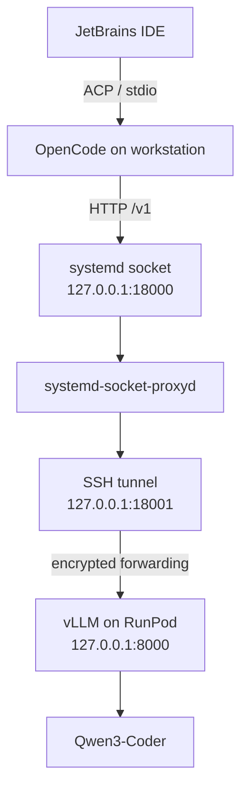
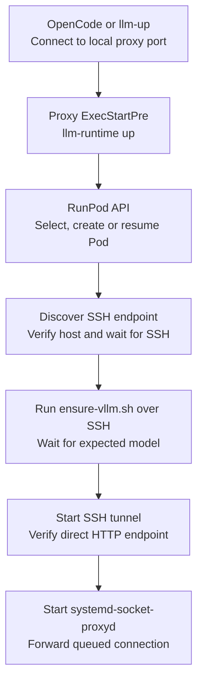
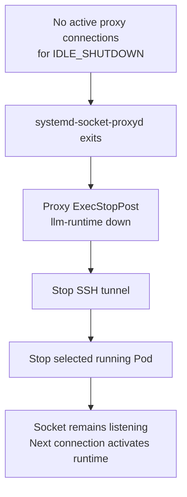

# Architecture

## Request path

Ports shown are the defaults. Both host listeners and vLLM bind to loopback.

```mermaid
flowchart TD
    IDE[JetBrains IDE] -->|ACP / stdio| OC[OpenCode on workstation]
    OC -->|HTTP /v1| Socket["systemd socket<br/>127.0.0.1:18000"]
    Socket --> Proxy[systemd-socket-proxyd]
    Proxy --> Tunnel["SSH tunnel<br/>127.0.0.1:18001"]
    Tunnel -->|encrypted forwarding| VLLM["vLLM on RunPod<br/>127.0.0.1:8000"]
    VLLM --> Model[Qwen3-Coder]
```

OpenCode owns local file, shell, build, and test operations. The Python
controller manages one non-interruptible GPU Pod through the RunPod REST API,
then connects as `root` over its public TCP SSH endpoint. Only `22/tcp` is
requested in the Pod definition. Model requests travel through SSH; lifecycle
requests use the RunPod HTTPS API.

## Activation and shutdown

### Activation

```mermaid
flowchart TD
    Request["OpenCode or llm-up<br/>Connect to local proxy port"]
    Startup["Proxy ExecStartPre<br/>llm-runtime up"]
    Pod["RunPod API<br/>Select, create or resume Pod"]
    SSH["Discover SSH endpoint<br/>Verify host and wait for SSH"]
    Model["Run ensure-vllm.sh over SSH<br/>Wait for expected model"]
    Tunnel["Start SSH tunnel<br/>Verify direct HTTP endpoint"]
    Proxy["Start systemd-socket-proxyd<br/>Forward queued connection"]
    Request --> Startup --> Pod --> SSH --> Model --> Tunnel --> Proxy
```

### Idle shutdown

```mermaid
flowchart TD
    Idle["No active proxy connections<br/>for IDLE_SHUTDOWN"]
    Exit["systemd-socket-proxyd exits"]
    Shutdown["Proxy ExecStopPost<br/>llm-runtime down"]
    Tunnel["Stop SSH tunnel"]
    Pod["Stop selected running Pod"]
    Ready["Socket remains listening<br/>Next connection activates runtime"]
    Idle --> Exit --> Shutdown --> Tunnel --> Pod --> Ready
```

### Lifecycle details

`opencode-runpod` generates configuration and starts `llm-up` in the background
while OpenCode starts. `llm-up` ensures generated units match configuration,
opens `/v1/models` on the socket, and monitors activation. It also recovers an
active proxy whose tunnel no longer responds.

Pod selection uses `runtime.pod-id` first. A persisted Pod specification
fingerprint must match the selected internal model contract; otherwise startup
stops the old Pod and creates a replacement without deleting the old Pod or
storage. Only a missing selection or a
provider 404 permits exact-name adoption; multiple matches fail. A new Pod is
created only by startup when no match exists. If creation reports an API error
but a unique Pod with the configured name has appeared, startup saves its ID
and specification and continues. An adopted Pod without a saved specification
requires manual verification before startup can replace it. Shutdown uses the
same selection logic and can adopt a named Pod; status never adopts or replaces
a selection.
A live persisted ID takes precedence over changes to `RUNPOD_POD_NAME`.

The SSH endpoint is bound to the selected Pod ID in local state. Stable
endpoints retain their host key. A provider-confirmed endpoint change for the
same Pod removes only the obsolete address from `known_hosts`. A changed Pod
identity or host-key mismatch fails closed. See [SSH trust](../SECURITY.md#dynamic-ssh-endpoints-and-host-keys).
A provider-confirmed 404 for a persisted or stale endpoint-bound Pod clears
only that Pod's stored endpoint and its precise `known_hosts` entry before a
replacement Pod enrolls.

Runtime startup, shutdown, full installation, and integration removal share a
nonblocking `flock` with bounded retries. Installation waits up to 30 seconds;
other operations use `LIFECYCLE_LOCK_TIMEOUT_SECONDS`. This does not serialize
all CLI actions: `llm-up` unit reconciliation and `llm-down` socket/proxy stops
occur outside that lock. Never delete `runtime.lock` to resolve contention.

The proxy startup budget is `RUNPOD_START_TIMEOUT_SECONDS` plus
`VLLM_START_TIMEOUT_SECONDS` plus 120 seconds. Pod endpoint discovery and SSH
readiness share the first budget; tunnel readiness gets 60 seconds. The proxy
stop timeout is three minutes. The tunnel restarts on failure after five
seconds. These budgets are not individual subprocess deadlines.

Idle means no active proxy connections, not absence of generated tokens.
`llm-down` stops the listener and proxy before runtime shutdown; it does not
remove socket enablement. Shutdown clears transient runtime metadata and
attempts both tunnel and Pod cleanup, reporting accumulated errors.
`ExecStopPost` also runs after failed activation; diagnostics may be cleared
by cleanup, so the service journal is the fallback.

`llm-down --remove-integration` asks for confirmation before any shutdown and
then removes `opencode.json` and the configured ACP agent entry. It preserves
units, configuration, credentials, Pod identity, storage, and other agents.
Future installation or activation can recreate the integration.

## Remote runtime and storage

The runtime image starts from the official CUDA 12.9 vLLM image, adds OpenSSH
and the RunPod Pod startup contract, and does not install vLLM or PyTorch.
The controller sends the packaged
`remote/ensure-vllm.sh` over SSH; this script runs
`/opt/llm-coding/bin/start-vllm.sh`, rather than installing dependencies.

`/workspace/llm-coding/` contains the Hugging Face cache (`huggingface/`),
`vllm.pid`, `vllm.log`, and `runtime.signature`. The script reuses a healthy
server only when its configuration signature matches; otherwise it stops the
recorded vLLM process and launches the image's executable. Version and vLLM
launch settings participate in that signature but do not verify or replace
installed binaries. The launcher enables prefix caching, request logging, and
automatic tool choice.

Keep `RUNPOD_VOLUME_MOUNT_PATH=/workspace`: the script's storage path is fixed.
The default Pod volume survives stops but is tied to the Pod. An optional
network volume is independently managed. The controller never deletes Pods
or volumes. In particular, vLLM and its dependencies are in the image, not on
the persistent volume.

## Local state and integration

See [configuration paths](configuration.md#paths) for XDG locations.

| State file | Role | Retained after shutdown |
| --- | --- | --- |
| `runtime.pod-id` | Selected provider identity; atomic, mode 0600 | Yes |
| `runtime.pod-spec.json` | Fingerprint of the model and immutable Pod request | Yes |
| `runtime.ssh-endpoint.json` | Pod ID, host, port; atomic, mode 0600 | Yes |
| `known_hosts` | Installation-specific SSH trust, mode 0600 | Yes |
| `runtime.lock` | Lifecycle lock and last operation label, mode 0600 | Yes |
| `runtime.env` | Tunnel host, port, and key path | No |
| `runtime.activation-status` | Latest startup stage, mode 0600 | No |
| `runtime.activation-error` | Best-effort startup failure, mode 0600 | No |
| `opencode.json` | Generated provider and permission configuration | Unless integration is removed |

Identity, SSH endpoint, generated OpenCode, and JetBrains ACP writes use atomic
replacement with mode 0600. Directory modes and `runtime.env` depend on the
user's umask. Activation diagnostics are best-effort and are not a durable
audit log.

ACP registration locks and writes `~/.jetbrains/acp.json`, preserves other agent
entries, and updates the shared `default_mcp_settings`. IDEA MCP defaults to
enabled; custom MCP defaults to disabled. These defaults can affect other ACP
agents.
OpenCode configuration is regenerated on wrapper launch and successful
`llm-up`; edit the templates or settings instead of generated files.

## Python module boundaries

| Module | Responsibility |
| --- | --- |
| `config.py` | Immutable settings, parsing, validation, XDG paths |
| `models.py` | Reviewed model, hardware, and vLLM launch contracts |
| `runpod.py` | REST requests, response validation, Pod creation payload |
| `systemd.py` | Authoritative unit renderer and user-systemd operations |
| `ssh.py` | Host authentication, endpoint rotation, tunnel execution |
| `opencode.py` | Release installation, configuration, ACP, process launch |
| `state.py` | Identity persistence, diagnostics, lifecycle lock |
| `runtime.py` | Lifecycle orchestration |
| `status.py` | Unit/provider/endpoint inspection and aggregation |
| `cli.py` | Click commands, activation monitoring, diagnostics |
| `interfaces.py` | Injectable transport, command, clock, and state protocols |
| `core.py` | Compatibility exports and legacy helpers |

Runtime accepts command, clock, sleep, systemd, and provider dependencies.
HTTP readiness probes still use `requests` directly; tests mock those calls.
Packaged assets under `python-src/llm_coding/assets/` supply installed runtime
resources and are the canonical copies used from a source checkout and a wheel.

### Compatibility inventory

An in-repository caller audit found that the installed CLI was the only
operational caller importing through `core.py`; it now imports each focused
owner directly. Tests also import focused owners. `core.py` remains public only
as a compatibility facade for downstream Python imports of its historical
exports.

The audit found no callers of `config.setting()`. The `runpod._value()` and
`opencode._value()` helpers were private, module-local mapping shims. The
dictionary branch in `runtime._start_pod_or_raise()` had no caller, while the
`hasattr(state, "state_dir")` branch in `runtime._select_pod()` was exercised
only by tests passing a mock `ConfigManager`. These shims have been removed:
operational functions require `Settings`, and Pod selection requires an
explicit `RuntimeState` implementation such as `FileStateStore`.

For downstream code that still combines `ConfigManager.load_config()` with
the historical `core.create_opencode_config()` export, `core.py` performs the
sole legacy mapping conversion through `LegacySettingsAdapter`. The adapter
runs full settings validation and constructs `Settings`. Passing a mapping to
that facade emits `DeprecationWarning`; downstream callers should migrate to
`ConfigManager.load_settings()` and pass `Settings` directly. No focused
operational module accepts legacy mappings.

## Status contract

`llm-status` inspects `LoadState`, `ActiveState`, and `SubState`, looks up the
persisted Pod, and probes `/v1/models` through the direct tunnel. It neither
activates the socket nor checks the response for the expected model ID.

| Exit | Meaning |
| --- | --- |
| `0` | All units active, Pod `RUNNING`, tunnel HTTP successful |
| `1` | All units inactive/missing and Pod stopped/absent; also CLI configuration errors |
| `2` | Inspection completed, but components are inconsistent or degraded |
| `3` | Unit, provider, or endpoint inspection failed |

A listening socket with stopped proxy/tunnel/Pod produces `2`, including after
normal idle shutdown. API and protocol errors remain distinct in output.

## Security boundary

OpenCode runs with the local user's filesystem and process permissions; tool
approval is not an OS sandbox. Secrets loaded from files are not exported by
the launcher, but existing environment variables are inherited. Local HTTP has
no API authentication. Remote request logs may contain prompts and source.
Use trusted repositories and read [SECURITY.md](../SECURITY.md).

## Runtime image releases

`.github/workflows/publish-runtime-image.yml` publishes one `linux/amd64`
image to `ghcr.io/<owner>/<repository>-runtime`. It builds from the official
`vllm/vllm-openai:v0.28.0-cu129-ubuntu2404` manifest-list digest
`sha256:56b291b6179fe5e6e6ad5c509d362e745280ccdbe81ecbc0f5155b1cab0ebfc5`.
The image adds OpenSSH, the RunPod startup wrapper, and a loopback-only
launcher. It starts `sshd`; the controller starts vLLM after connecting.

The workflow checks versions and local SSH startup before promoting the
`cuda129` discovery alias. Model profiles use the verified published digest
`sha256:e5899e0f548aaf2a5c9bab129fe4ded0855c39517214fd99e6e3ff839ab378db`.
A new publication does not change existing profiles. The workflow publishes
provenance using `GITHUB_TOKEN`.

The Pod request restricts host CUDA capability to `12.9` or `13.0`. This
placement filter and the image digest participate in the persisted Pod
fingerprint. A changed contract replaces the selected Pod without deleting
the old Pod or its storage. Actual GPU compatibility still requires inference
qualification for each model and GPU type.

The official image supplies the CUDA runtime, PyTorch, and vLLM. llm-coding
adds only its `start-vllm` launcher and a RunPod Pod startup script. The latter
installs the injected SSH public key, generates host keys at runtime, and runs
`sshd`; it does not start a model server. `start-vllm` remains responsible for
launching vLLM on `127.0.0.1` after the controller connects over SSH.

Image validation asserts PyTorch `2.13.0`, CUDA `12.9.x`, and vLLM `0.28.0`.
Only the exact reviewed upstream `pip check` mismatch between Torch's NCCL
`2.29.7` requirement and installed `2.30.7` is accepted. Other dependency
errors fail the build. GPU qualification must determine whether the mismatch
affects inference.

See [runtime qualification](runtime-qualification.md) for the required RunPod
GPU gate and its recorded results. The profile digest is published and checked
in CI, but is not yet qualified on a RunPod GPU.

For private GHCR images, store a read-only package token as a RunPod registry
credential and set only its ID locally. The publishing repository determines
the image name; do not assume the example repository path is your output.
See [upstream references](references.md) for registry authentication and pins.
